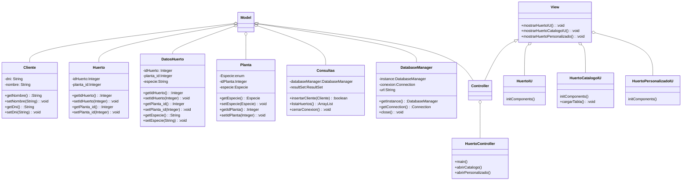
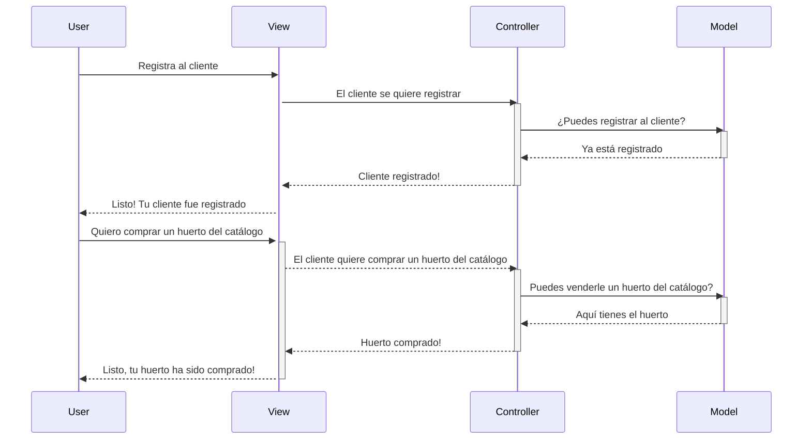

## TIENDA DE HUERTOS

*¡Bienvenid@ a nuestra tienda!*

Este proyecto es una aplicación que permite gestionar una tienda 
que vende huertos, los cuales pueden contener plantas de distintas especies
como tomate, lechuga, mango o zanahoria. Los clientes pueden resgistrarse
y seleccionar qué desean comprar, si huertos del catálogo o personalizar
uno a su gusto. La aplicación se conecta a una base de datos SQLite y realiza
consultas para mostrar resultados específicos.

## DIAGRAMA DE CLASES

## DIAGRAMA DE SECUENCIA
El diagrama de secuencia de este proyecto, es una representación visual de las interacciones y 
la secuencia de eventos en el proyecto, lo que facilita la comprensión y el análisis del flujo de 
ejecución y la comunicación entre los diferentes componentes del sistema. Sigue el patrón de diseño MVC, el cual
observaremos mejor gracias a este diagrama.

